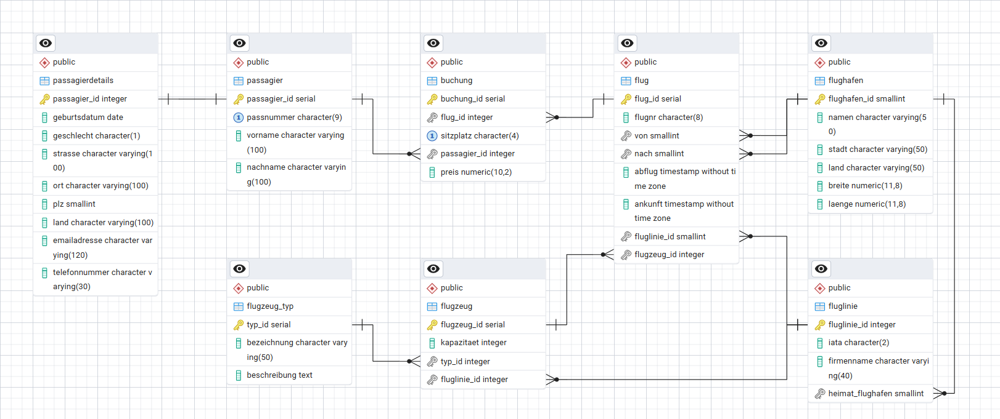

# Airline Database – SQL Data Modeling & Analysis

This project demonstrates the design and analysis of a relational airline booking database using **pure SQL**.  
It was developed as part of a data analytics training program and transformed into a portfolio-ready project with a strong focus on **data modeling, relational integrity, and analytical querying**.

The repository covers the full workflow from **conceptual modeling (ERD)** to **schema creation**, **sample data insertion**, and **business-oriented SQL analysis**.

---

## Project Scope

The database models a simplified airline booking system including:

- Passengers and passenger details  
- Bookings and ticket prices  
- Flights, airlines, aircraft, and aircraft types  
- Airports with geographic information  

The project uses **sample data** for demonstration purposes.  
Analytical results do not represent real-world airline operations.

---

## Database Schema (ERD)

The entity-relationship diagram illustrates all tables, primary keys, foreign keys, and relationships used in the database.



---

## Repository Structure

```text
airline-database-sql/
│
├── README.md
│
├── erd/
│   └── airport-erd.png
│
├── schema/
│   ├── 1_insert_sample_data_flughafen.sql
│   ├── 2_insert_sample_data_flugzeug_typ.sql
│   ├── 3_insert_sample_data_fluglinie.sql
│   ├── 4_insert_sample_data_flugzeug.sql
│   ├── 5_insert_sample_data_passagier.sql
│   ├── 6_insert_sample_data_passagierdetails.sql
│   ├── 7_insert_sample_data_flug.sql
│   └── 8_insert_sample_data_buchungen.sql
│
├── queries/
│   └── advanced_queries.sql
